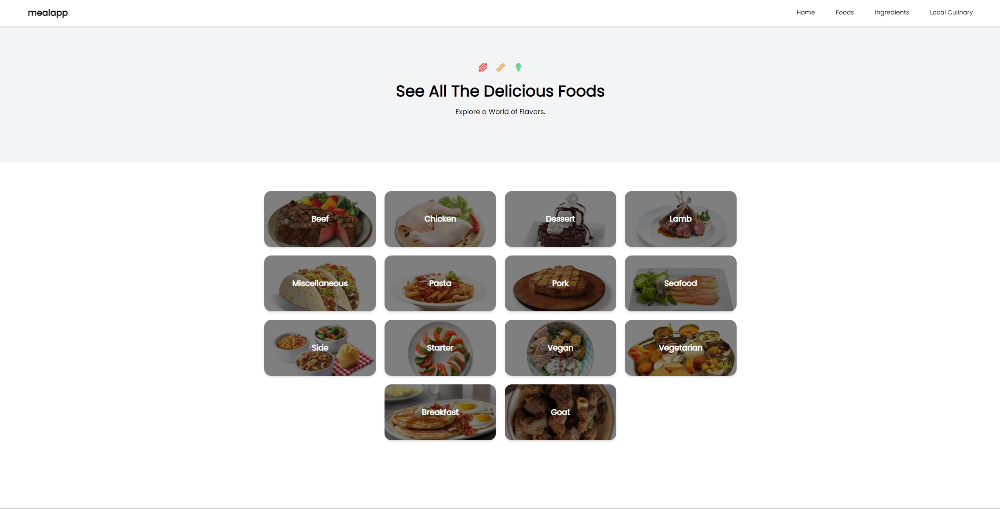
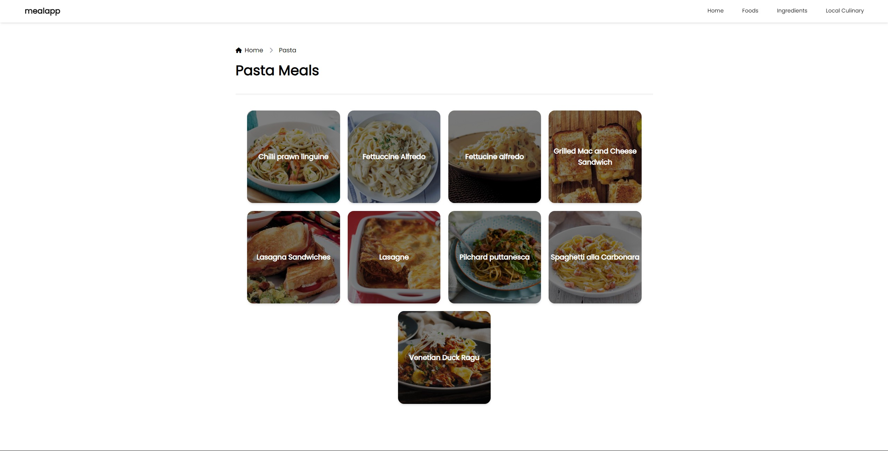
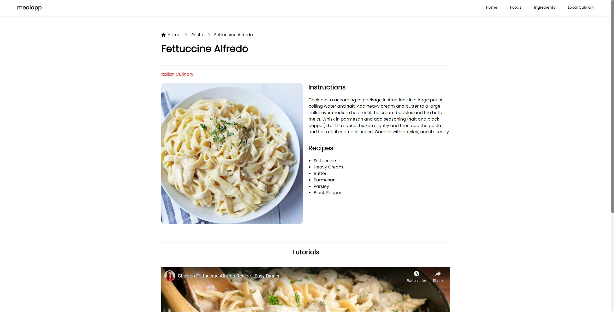

<a id="readme-top"></a>

<!-- PROJECT LOGO -->
<br />
<div align="center">
  

  <h3 align="center">MealApp</h3>

  <p align="center">
    A simple web app to explore food categories and meal recipes worldwide, built for Front-end Developer Internship tasks @cmlabs.
    <br />
  </p>
</div>


<!-- TABLE OF CONTENTS -->
<details>
  <summary>Table of Contents</summary>
  <ol>
    <li>
      <a href="#about-the-project">About The Project</a>
      <ul>
        <li><a href="#built-with">Built With</a></li>
      </ul>
    </li>
    <li>
      <a href="#getting-started">Getting Started</a>
      <ul>
        <li><a href="#prerequisites">Prerequisites</a></li>
        <li><a href="#how-to-run-the-project">How to run the project</a></li>
        <li><a href="#run-from-the-deployed-version">Run from the deployed version</a></li>
      </ul>
    </li>
    <li><a href="#contact">Contact</a></li>
  </ol>
</details>


<!-- ABOUT THE PROJECT -->
## About The Project




MealApp is a web application that allows users to explore and discover various food categories and detailed meal recipes from around the world. It provides an easy-to-navigate platform with visual meal cards, dynamic category browsing, and interactive meal details.

<p align="right">(<a href="#readme-top">back to top</a>)</p>


### Built With

* [![HTML][HTML]][HTML-url]
* [![Tailwind.css][Tailwind.css]][Tailwind-url]
* [![JavaScript][JavaScript]][JavaScript-url]
* [![jQuery][jQuery]][jQuery-url]
* [![AJAX][AJAX]][AJAX-url]

<p align="right">(<a href="#readme-top">back to top</a>)</p>


<!-- GETTING STARTED -->
## Getting Started

### Prerequisites
- To run this project, you need to have a code editor installed on your machine, preferably Visual Studio Code (VSCode).
- Download and install VSCode extension:
  - [Live Preview](https://marketplace.visualstudio.com/items?itemName=ms-vscode.live-server)

### How to run the project

1. Clone the repo
   ```sh
   git clone https://github.com/bernarduswillson/cmlabs-frontend-internship-test.git
   ```
2. Open the project folder in your preferred code editor.
3. If you are using VSCode, run the project using Live Server:
    - Right-click on the index.html file.
    - Select Open with Live Server to view the app.

*4. Or alternatively, you can run the project using Python.*

5. Make sure you have Python installed on your machine. You can check if it’s installed by running the following command in your terminal:
```sh
python --version
```
6. Navigate to the project directory in your terminal.
7. Run the following command to start a local server:
```sh
python -m http.server
```
8. Open your browser and go to `http://localhost:8000` to view the app.


### Run from the deployed version

1. Open your browser and go to `https://mealapp-bewe.vercel.app`

<p align="right">(<a href="#readme-top">back to top</a>)</p>

<!-- CONTACT -->
## Contact

Bernardus Willson - bernardus.willson@gmail.com

Project Link: [https://github.com/bernarduswillson/cmlabs-frontend-internship-test](https://github.com/bernarduswillson/cmlabs-frontend-internship-test)

<p align="right">(<a href="#readme-top">back to top</a>)</p>


[HTML]: https://img.shields.io/badge/HTML5-E34F26?style=for-the-badge&logo=html5&logoColor=white
[HTML-url]: https://developer.mozilla.org/en-US/docs/Web/HTML
[Tailwind.css]: https://img.shields.io/badge/Tailwind_CSS-38B2AC?style=for-the-badge&logo=tailwind-css&logoColor=white
[Tailwind-url]: https://tailwindcss.com/
[JavaScript]: https://img.shields.io/badge/JavaScript-F7DF1E?style=for-the-badge&logo=javascript&logoColor=black
[JavaScript-url]: https://developer.mozilla.org/en-US/docs/Web/JavaScript
[jQuery]: https://img.shields.io/badge/jQuery-0769AD?style=for-the-badge&logo=jquery&logoColor=white
[jQuery-url]: https://jquery.com/
[AJAX]: https://img.shields.io/badge/AJAX-0057D9?style=for-the-badge&logo=ajax&logoColor=white
[AJAX-url]: https://www.w3schools.com/js/js_ajax_intro.asp